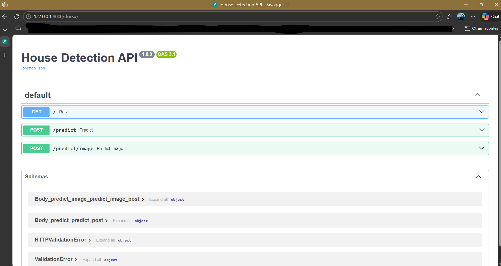
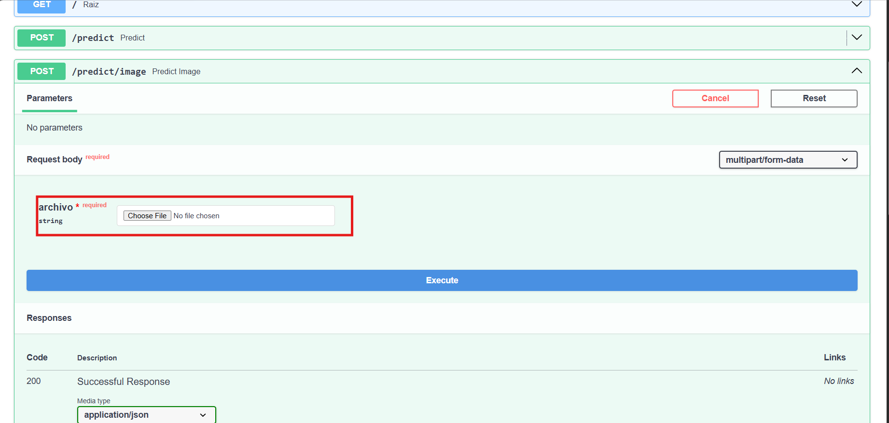
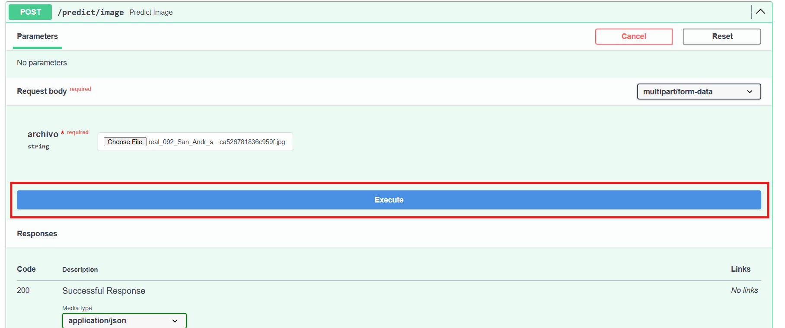
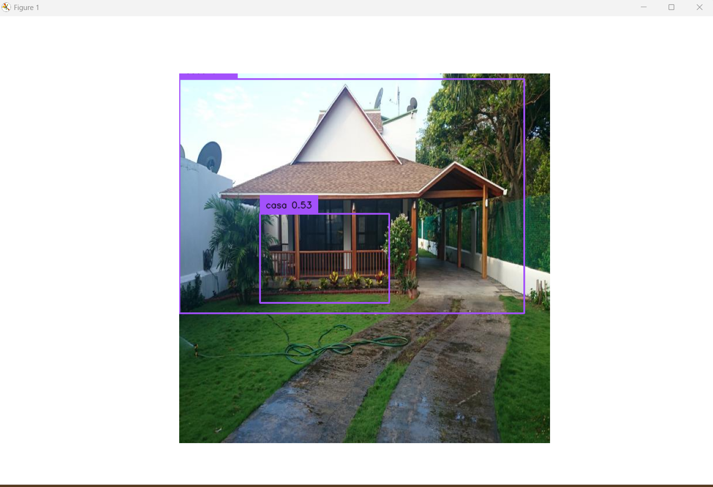
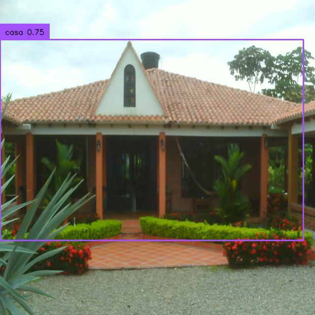
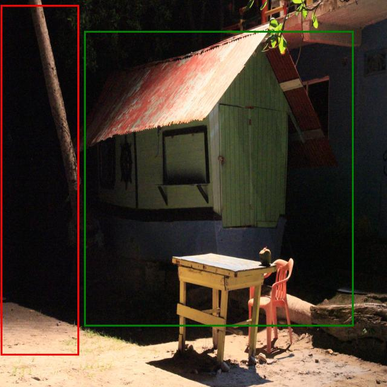
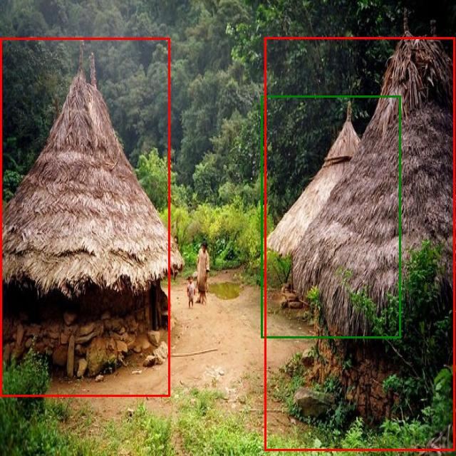

# Proyecto YOLO - Identificación de Casas con Modelo Basado en YOLO


# Descripción general del proyecto


YOLO-house-idenfifier es una herramienta que permite el etiquetado de fachadas de casas. Puede importara libreria o mediante una API

# Estructura del repositorio

```text
taller-yolo-casas-dcroz-castelblanco-penaloza/

├── API/   # Aplicaciòn por FastAPI
│   ├── API_inference.py
│
├── models/ # Modelos e historial de entrenamientos
│   ├── runs_house_model/house_yolo
│   ├── house_yolo.pt
│   ├── yolo11n.pt
│     
├── src/
│   ├── inference.py   # Script para ejecutar ingerencia
│   ├── train_yolo.py  # SCript para recrear entrenamiento
│   └── utils.py       # Funciones recurrentes y sistema de rutas
│
├── examples/   # Ejemplos de TP y tutorial API
│
├── error analysis/   # Resultados de entrenamiento custom
│   ├── false_positives
│   ├── false_negatives 
│
├── images/          # Imagenes para entrenamiento
│   ├── confg
│      ├── data.yalm 
│      ├── house_project.v1i.yolov11.zip # Etiquietas generadas desde roboflow
│   ├── test # Requiere descomprimir .zip (ver secciòn 3)
│      ├── images
│      ├── labels
│   ├── train
│   ├── valid
│
├── README.md            # Documentación del proyecto
├── requirements.txt     # Lista de dependencias del proyecto

```


# Requerimientos


```bash
pip install ultralytics==8.4.21

pip install supervision==0.27.0.post1

pip install albumentations==2.0.8

pip install fastapi==0.135.1

pip install python_multipart==0.0.22

pip install uvicorn==0.24.0  
```
Si requiere una instalación local con uso de GPU, consultar requerimientos de [ultralytics](https://docs.ultralytics.com/quickstart/) para instalación de Torch con CUDA.

# Construcción de la Herramienta

## Datos de entrenamiento

Se obtuvieron las imágenes del siguiente [repositorio](https://drive.google.com/drive/folders/1F0ZShSpEq7DVzTN4xrlTPYH8QZA--fTg?usp=drive_link), con 69 casa donde podríamos identificar fachadas.

En las imágenes se hizo el etiquetado de la catergoría casa usando [Roboflow](https://roboflow.com/), las cuales se pueden consultar en este [proyecto](https://universe.roboflow.com/marias-workspace-grsiu/house_project-ffi14/dataset/1). Los datos se dividieron en 52 entradas para entrenamiento, 10 para validación y 7 para pruebas.

## Arquitectura del modelo

Se eligió usar un modelo [YOLO11](https://docs.ultralytics.com/es/models/yolo11/) y hacer un 
Fine Tunning para mejorar la detección fr nuestras características (casas).

## Instrucciones para reproducir el entrenamiento y la inferencia

A continuación se describen los pasos necesarios para reproducir el entrenamiento del modelo y ejecutar inferencia sobre nuevas imágenes.

### 1. Clonar el repositorio

```bash

git clone https://github.com/<usuario>/taller-yolo-casas-dcroz-castelblanco-penaloza

```

### 2. Instalar dependencias

Instalar las dependencias definidas en el archivo requirements.txt:

```bash
pip install -r requirements.txt
```

Revisar sección de requerimientos para más detalles.

### 3. Preparar el dataset (Opcional)

Puede validar que los archivos de entrenamiento esten presentes para la rutina de entrnamiento en la ruta:

`images/conf/house.project.v1.yolo11.zip`

La rutina de entrnamiento (train_model de src.train_yolo) ya hace la descompresión de las carpetas, no obstante, puede hacer la descompresión manual o usando la función unzip_dataset() de la liberia src.utils.

> [!NOTE]
> Si no planea ejecutar la rutina de entrenamiento, **DEBE descomprimir el `house.project.v1.yolo11.zip`** para poder probar las otras funcionalidades o validar los ejemplos.
> **No se incluyen las imagenes en el repositorio, dado que los nombres largos pueden interferir al hacer pull.**

### 4. Entrenar el modelo

Para entrenar el modelo ejecutar:

```bash
python src/train.py
```

Este script entrena el modelo YOLO utilizando el dataset definido en `data.yaml`.

Los pesos generados durante el entrenamiento se almacenan en la carpeta:

`models/runs_house_model/house_yolo/weights`

La rutina también crea un modelo listo para importar con los pesos aplicados en la ruta 

`modesl/house_yolo.pt`

### 5. Evaluar el modelo

Para evaluar el desempeño del modelo y calcular métricas como falsos positivos (FP) y falsos negativos (FN), ejecutar:

```bash
python src/validation.py
```

Esto analiza las predicciones del modelo sobre el conjunto de validación y genera métricas de desempeño.

Si bien en la carpeta de las corridas del modelo tenemos ejemplos de las clasificaciones, y todas las métricas de evaluación y seguimiento de la entrenamiento epoca por epoca, se hace la clasificación de las imágenes según la matriz de confusión para tener la totalidad de ejemplo de FP y FN.

### 5. Usar el modelo

El script de inferencia cargará el modelo entrenado y generará detecciones sobre las imágenes de prueba, dibujando los bounding boxes correspondientes. Se puede emplear de 3 modos:

### Mediante liberia (Python)

Estructura

```python
from src.inference import infer
res = inf.infer(image_path = './input_path/image.jpg' )
```

**Ejemplo**
```python
from src import inference as inf
res = inf.infer(image_path = './images/valid/images/real_041_MI_HOUSE_png.rf.0e452c2b0051f1281e7c048c3f3d5605.jpg'
                ,out_path= './examples' )
```


### Mediante terminal (CLI)

```bash
python src/inference.py ./input_path/image.jpg --output./output_path

```

**Ejemplo**
```bash
python ./src/inference.py images\valid\images\real_011_Casa_de_Cundinamarca_png.rf.b1da1d02fbd326e25e036adc2c977503.jpg -o./examples
```

### Mediante API

Debe hacer la conexión a la API. Asegurese de estar en el directorio de la API para poder iniciarla
```bash
cd ./API
```

Estando en el directorio `./API`, puede ejecutar lo siguiente para iniciar el servicio.

```bash
uvicorn API_inference:app --reload
```

**Ejemplo**

En nuestro ejemplo, el servicio quedó en `http://127.0.0.1:8000/docs/`, de donde podemos probar los mètodos predict y predic_image. (Revise en consola donde esta corriendo la aplicaciòn)



En este ejemplo, probaremos el método predict_image.Puede cargar el archivo mediante el toolkit de adjuntar.



Con el archivo adjunto, haga el llamado mediante el botòn de Exceute



Verá que el método trae una ventana emergente con la información de salida





# Resultados (métricas) y ejemplos de detección

## Resultados (métricas) y ejemplos de detección

El modelo fue evaluado utilizando el conjunto de validación definido en el dataset.

Las métricas principales utilizadas fueron:

- **Precision**
- **Recall**
- **Falsos Positivos (FP)**
- **Falsos Negativos (FN)**

Resultados obtenidos:

| Métrica | Valor |
|------|------|
| Precision | 0.8571 |
| Recall |  0.7500 |
| mAP@0.5 |  0.838 |
| False Positives | 2 |
| False Negatives | 4 |

### Ejemplo de detección correcta

En la siguiente imágen, el modelo logra identificar correctamente la fachadas de una casa presente en la escena.



### Ejemplos de errores de detección

Se identificaron algunos casos donde el modelo presenta errores y los guarda en la carpeta error_analysis.

#### **Falsos positivos (FP)**  
El modelo detecta una casa en objetos visualmente similares, como edificios o estructuras arquitectónicas.

**Ejemplo**

 En rojo se muestran las predicciones, y en verde las etiquetas.



**Falsos negativos (FN)**  
El modelo no detecta casas cuando:

- la fachada está parcialmente oculta
- la iluminación es baja
- la casa aparece muy pequeña en la imagen

**Ejemplo**

 En verde se muestran las predicciones, y en rojo las etiquetas.



# Limitaciones y pasos futuros recomendados

### Limitaciones del modelo

A pesar de los resultados obtenidos, el modelo presenta algunas limitaciones:

1. **Tamaño reducido del dataset**

El modelo fue entrenado con un conjunto de aproximadamente 69 imágenes, lo cual es un tamaño limitado para entrenar modelos de detección de objetos robustos.

Esto puede provocar:

- sobreajuste (overfitting)
- baja capacidad de generalización a nuevas imágenes.

2. **Variabilidad limitada en las escenas**

Las imágenes del dataset no cubren completamente todas las variaciones posibles de:

- arquitectura
- iluminación
- ángulos de cámara
- contextos urbanos y rurales.

3. **Confusión con estructuras similares**

El modelo puede confundir casas con:

- edificios
- locales comerciales
- construcciones con fachada similar.
- Reflejos en agua de la misma casa

4. **Resolución de imagen**

En imágenes donde la casa aparece muy pequeña, el modelo presenta dificultades para detectar correctamente el objeto.

---

### Trabajo futuro

Para mejorar el desempeño del modelo se recomiendan las siguientes acciones:

**1. Ampliar el dataset**

Recolectar y etiquetar más imágenes de casas en diferentes contextos:

- urbano
- rural
- diferentes regiones de Colombia
- diferentes condiciones de iluminación.

Idealmente aumentar el dataset a **200–500 imágenes**.

**2. Aplicar técnicas de aumento de datos**

Utilizar técnicas de *data augmentation* como:

- rotaciones
- cambios de brillo y contraste
- escalamiento
- transformaciones geométricas.

**3. Ajuste de hiperparámetros**

Realizar experimentación con diferentes valores de:

- número de épocas
- tamaño de imagen
- learning rate
- batch size.

**4. Evaluación con más métricas**

Incorporar análisis adicionales como:

- matriz de confusión
- curvas Precision-Recall
- evaluación en datasets externos.


